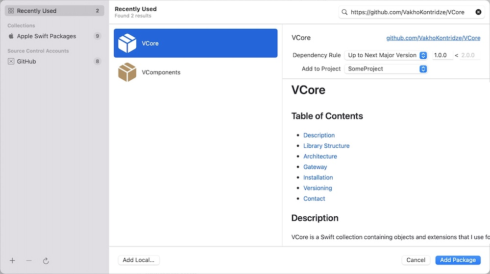
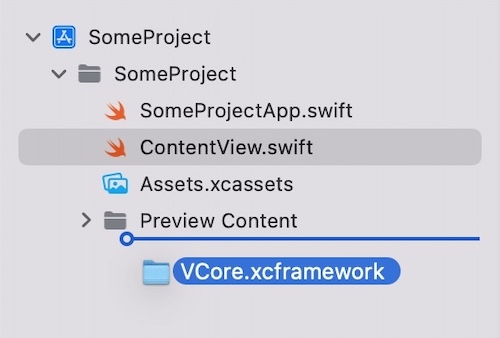
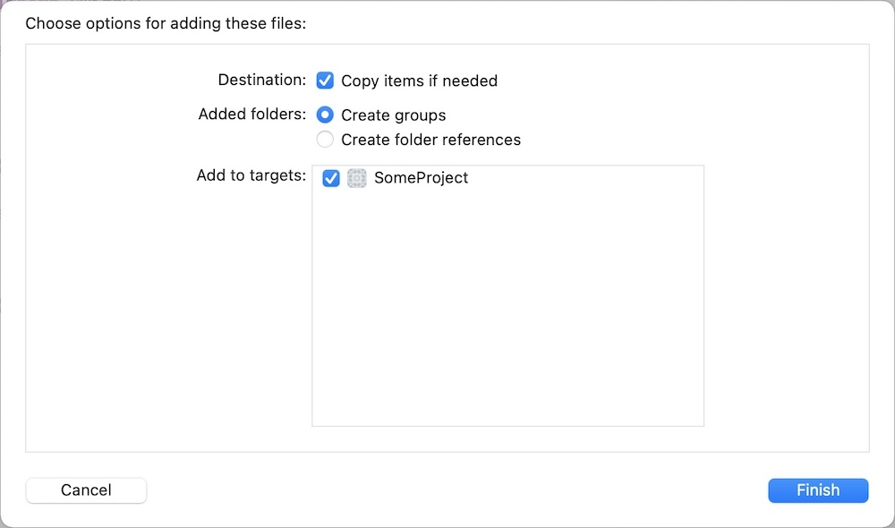

# VCore

## Table of Contents

- [Description](#description)
- [Library Structure](#library-structure)
- [Architecture](#architecture)
- [Gateway](#gateway)
- [Demo](#demo)
- [Installation](#installation)
- [Versioning](#versioning)
- [Contact](#contact)

## Description

VCore is a Swift collection containing objects and extensions that I use for all my projects

Library supports iOS 13.0 and up.

## Library Structure

Project files are grouped as:

- ***Views and ViewContollers***. Reusable non-scene views and viewcontrollers.

- ***Services and Managers***. Services, managers, controllers, and formatters. For instance, `NetworkClient`.

- ***Helpers***. Non-service, non-extension objects and methods. For instance, helper methods for creating `GenericStateModel`'s and `StandardNavigable`.

- ***Global Functions***. Global functions. For instance, `TODO` and operators.

- ***Extensions***. Global extensions. Methods and properties are grouped by frameworks of origin—`Foundation`, `UIKit`, and `SwiftUI`.

Project incudes folder `Extra`, which contains:

- ***XCode Templates***. Templates that can be used for accelerating workflow. Currently, templates cover  [scenes](#architecture) and [gateways](#gateway).

- ***Misc***. Objects and methods that cannot be included in a library as they require additional customization or access to `AppDelegate`/`SceneDelegate`.

## Architecture

Library includes templates for developing scenes using a VIPER architecture. Architecture is highly-decoupled, follows modular design, obeys the single-responsibility principle, and is built on the interface communication pattern.

To avoid writing boilerplate for every scene, the project includes `XCode` templates.

### Scene Components

#### Factory

A factory and a dependency injector that creates a scene and injects all related objects.

`Factory` takes a `viewModel` as parameter if there is a data passed from the previous scene in the navigation. Factory is a non-initializable struct with static factory methods. By default, `Factory` includes a single method, that creates a default instance of the scene.

Since objects are communicating using protocols, some can be swapped out with a non-default implementation. For instance, we can place `Presenter` and `ViewController` in a shared framework, and implement different `Interactor`'s and `Router`'s in two separate apps, subsequently reusing the same scene while only changing endpoints that they connect to and scenes to which we can navigate to. When even just one scene component is replaced, a new method must be added to `Factory`, as it requires a different dependency injection.

#### Interface

While not technically an object, this file lists all protocols that explain communication within the objects.

Interface has five protocols:

| Protocol    | Conformance    | Owner          | Ownership |
| :---------- | :------------- | :------------- | :-------- |
| Viewable    | ViewController | Presenter      | unowned   |
| Navigable   | Router         | Presenter      | unowned   |
| Presentable | Presenter      | ViewController | strong    |
| Routable    | Router         | Presenter      | strong    |
| Interactive | Interactor     | Presenter      | strong    |

#### ViewController (Viewable + Navigable)

##### Definition

View of the scene.

##### Responsibilities

Responsibilities of the `ViewController` include:

- Initializing and storing views
- Adding them to subviews
- Setting up a layout
- Reconfiguring self or subviews

Responsibilities of the `ViewController` do not include:

- Storing and managing data, as it's entirely taken by a `Presenter`

##### Viewable

`Viewable` protocol is used by `Presenter` for configuring and modifying the view during runtime. Some properties and methods used in the protocol may include:
    
```swift
func setContinueButtonState(to isUserInteractionEnabled: Bool)
func setInfoLabelText(to text: String)
```

##### Navigable

`Navigable` protocol is used by `Router` to perform navigation and presentation of scenes. By default, `Navigable` protocol conforms to `StandardNavigable` protocol—a helper protocol used in all scenes. `StandardNavigable` has a default implementation for `UIViewController`, and thus, additional implementation is required. API of `StandardNavigable` is the following:

```swift
protocol StandardNavigable {
    func push(_ viewController: UIViewController)
    func pop()
    func popToRoot()
    
    func present(_ viewController: UIViewController)
    func dismiss()
    
    func setRoot(to viewController: UIViewController)
}
```
    
#### Presenter (Presentable) ***(Optional)***

##### Definition

The Central object in the scene that controls the logic and binds everything together.

##### Responsibilities

Responsibilities of the `Presenter` include:

- Connecting all scene components
- Communicating with `Router` to trigger navigation towards or presentation of scenes, which in turn communicates with `ViewController`
- Communicating with `Interactor` to fetch data
- Storing the majority of the present in the scene. This includes `viewModel` passed from the previous scene.

Responsibilities of the `Presenter` do not include:

- Importing `UIKit` and managing UI-specific data, unless absolutely necessary

##### Presentable

`Presentable` protocol is used by `ViewController` to notify `Presenter` that an event or an action has occurred. Some properties and methods used in the protocol may include:

```swift
func viewDidLoad()
func didTapContinueButton()
```

#### Router (Routable) ***(Optional)***

##### Definition

Navigator of the scene that performs navigation towards and presentation of scenes.

##### Responsibilities

`Router` has access to `ViewController` view `Navigable` protocol, which allows it to access the navigation stack. By default, `Navigable` protocol conforms to `StandardNavigable` protocol.

##### Routable

`Routable` protocol is used by `Presenter` to trigger navigation towards or presentation of scenes. Some methods used in the protocol may include:
    
```swift
func toSomeScene()
func toSomeOtherScene(viewModel: SomeOtherSceneViewModel)
```
    
#### Interactor (Interactive) ***(Optional)***

##### Definition

Performs fetch request to remote or local databases.

##### Responsibilities

Responsibilities of the `Interactor` include:

- Calling `Gateway`'s for fetch request. That's why an `Interactive` has a combined protocol body of all the `Gateway`'s it has access to.

Responsibilities of the `Interactor` do not include:

- Performing fetch requests on its own independent of a `Gateway`.

##### Interactive

`Interacive` protocol is used by `Presenter` to perform fetch requests. Some methods used in the protocol may include:

```swift
func fetchSomeData(parameters: SomeParameters) async throws -> SomeEntity
```

#### ViewModel ***(Optional)***

##### Definition

Data passed to the scene from the previous one.

##### Responsibilities

Owned by `Presenter`.

#### Model ***(Optional)***

##### Definition

A non-initalizable static object that contains information needed for laying out a `ViewController`.

##### Responsibilities

Object breaks down into 5 sub-objects—`Layout`, `Colors`, `Fonts`, `Animations`, and `Misc`.

## Gateway

Protocol that defines a method by which a single fetch request is performed to a relational database—either remote or local.

To avoid writing boilerplate for every gateway, the project includes `XCode` templates.

### Gateway Components

#### Gatewayable

Defines an interface by which a fetch request can occur. `Gateway` should only contain a single method.

#### Parameters

Parameters used for the fetch request. A struct, that can conform to `Encodable`.

#### Entity

Entity that's returned from the fetch request. Also a struct, that can conform to `Decodable`.

#### _ Gateway

A specific implementation of a gateway. To differentiate the gateways from one another, a prefix is used. For instance, `UpdateUserDataNetworkGateway` or `UpdateUserDataCoreDataGateway`.

### Interactor-Gateway Relation

Although an `Interactor` component in VIPER is part of the scene, Gateways are not bound to specific scenes.

This design choice follows CLEAN architecture. But we are not using `UseCase`'s as their responsibility is entirely covered by `Interactor`'s.

Relation between an `Interactor`  and `Gateway` is the following:

```swift
protocol UpdateUserDataGatewayable {
    func fetch(with parameters: UpdateUserDataParameters) async throws -> UpdateUserDataEntity
}

struct UpdateUserDataNetworkGateway: UpdateUserDataGatewayable {
    func fetch(with parameters: UpdateUserDataParameters) async throws -> UpdateUserDataEntity {
        // Implementation
    }
}
```

```swift
protocol HomeInteractive {
    func updateUserData(with parameters: UpdateUserDataParameters) async throws -> UpdateUserDataEntity
}

struct HomeInteractor: HomeInteractive {
    func updateUserData(with parameters: UpdateUserDataParameters) async throws -> UpdateUserDataEntity {
        try await UpdateUserDataNetworkGateway().fetch(with: parameters)
    }
}
```

## Demo

Project contains demo app, that can be used to test functionality of the library.

## Installation

Library doesn't support CocoaPods or Carthage.

### Swift Package Manager

Add `https://github.com/VakhoKontridze/VCore` as a Swift Package in Xcode and follow the instructions.



### Manual

1. Download [VCore.xcframework](https://github.com/VakhoKontridze/VCore/releases/download/2.0.0/VCore.xcframework.zip).

2. Extract the zip.

3. Drag  `VCore.xcframework` into your project.



4. Select "Copy items if needed" and click Finish.



5. Go to the target settings for your app, under "General" tab, find "Frameworks, Libraries, and Embedded Content". Set the `VCore.xcframework` to “Embed & Sign”.


### Building Your Own Target

Since VCore is open-source, you can clone the project and build the framework target yourself.

## Versioning

***Major***. Major changes, such as big overhauls

***Minor***. Minor changes, such as new objects or extensions

***Patch***. Bug fixes and improvements

## Contact

e-mail: vakho.kontridze@gmail.com
